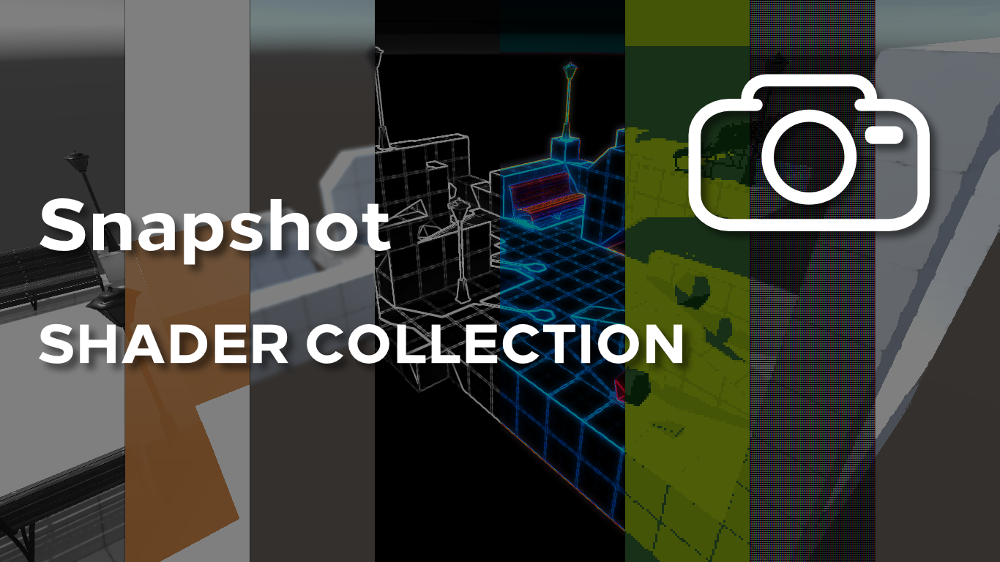

# Snapshot Shader Collection

## Overview
This repository contains a Unity project forked from https://github.com/daniel-ilett/smo-shaders, a tutorial series about image effect shaders. This repository contains the basis for a Unity Asset Store package based on those filters.

### Shaders Included
Several filters are included in this project:
- Greyscale;
- Sepia-tone;
- Silhouette;
- Blur (Full Blur);
- Blur (Edge Blur);
- Outline;
- Neon;
- NES;
- SNES;
- Game Boy;
- Painting.

### Scripts Included
Snapshot Mode is controlled by a set of core scripts which control the behaviour of the shaders:
- `SnapshotMode.cs`;
- `SnapshotFilter.cs`;
- `SnapshotCanvas.cs`.

Additionally, more scripts related to the test scene are included:
- `CameraMove.cs`;
- `Rotate.cs`;
- `Hover.cs`.

### Assets
This project is self-contained - it only uses content created specifically for this series.

## Software
The project was created using Unity 2019.1.3f1, but it should be possible to upgrade or downgrade to other versions of Unity.

## Authors
This package was written by [Daniel Ilett](https://danielilett.com/).

Thanks for using my assets in your projects.

❤
